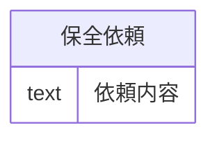

# `DATA-0001` データモデル投影

この図は `data_models` から生成したMermaid投影であり、候補意味正本ではない。正本は `10_se_model.json`（物理入力: `experiments/structured-document-se-prompt/examples/representative_model.json`）である。図の生成・描画はデータモデルの意味や状態を承認しない。

## 正本から投影した値

- データモデルID: `DATA-0001`
- 名称: 保全依頼論理データモデル
- 種別: `data_model`
- モデル種別: `logical`
- エンティティ候補: `保全依頼`
- 属性候補: `依頼内容` / `text`
- 関係候補: `[]`

`relationship_candidates` が空のため、関係線は描いていない。Mermaidで使用する識別子表現は表示用の投影であり、正本のID、名称、状態を変更しない。
